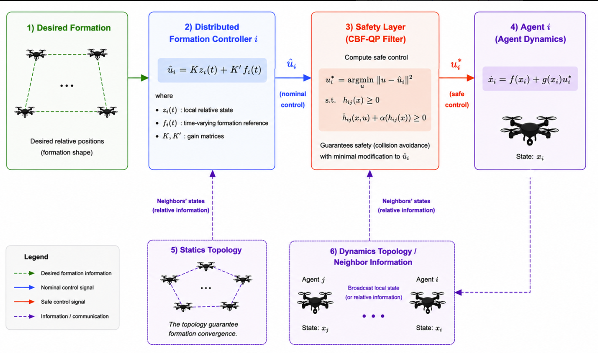
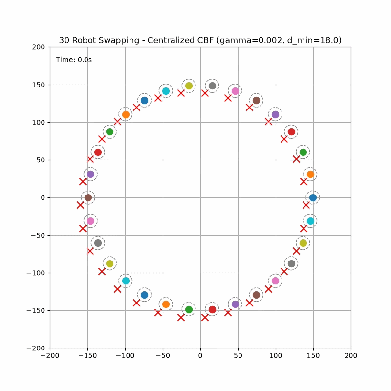
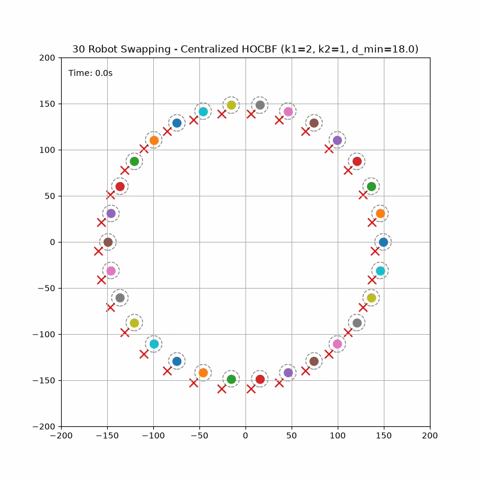
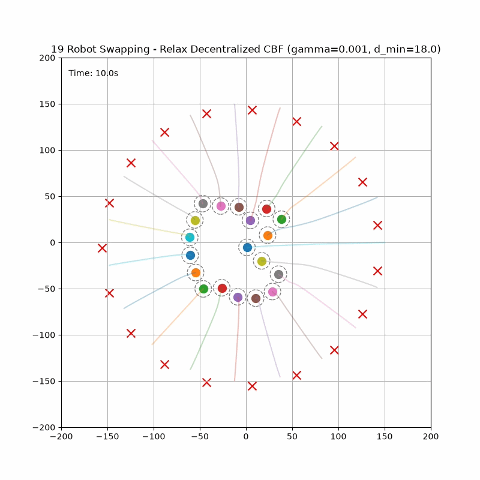
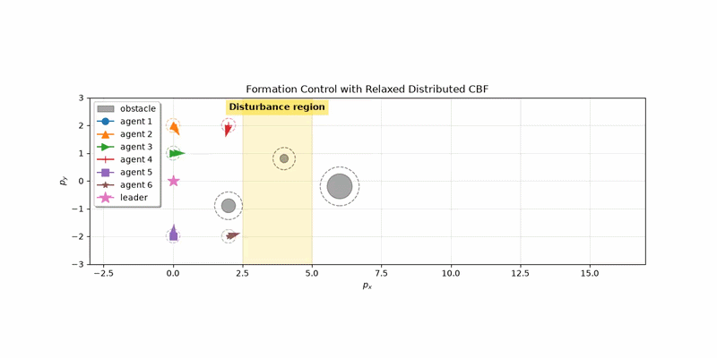

# Safe Formation Control for Multi-Robot Systems

Multi-robot formation control must satisfy two competing objectives:

- track a desired formation relative to a leader or reference trajectory;
- maintain safety by avoiding inter-agent and obstacle collisions while respecting actuator constraints.

This repository studies a two-layer control architecture:

1. a **distributed formation controller** that generates the nominal control input;
2. a **CBF-QP safety filter** that minimally modifies the nominal input whenever safety constraints are at risk.

<p align="center">
  
</p>

## Project Objectives

### 1. Distributed formation control

The first objective is to understand and implement a distributed state-feedback formation controller. The feedback gains \(K\) and \(K'\) are obtained through an LMI-based design and are used to drive the multi-robot system toward the desired formation using local information.

This controller serves as the **nominal controller** of the overall framework.

### 2. CBF-QP safety filtering

The second objective is to understand, implement, and compare several Control Barrier Function (CBF)-based safety filters:

- Centralized Zeroing CBF (ZCBF)
- Distributed ZCBF
- Relaxed Distributed CBF (RDCBF)
- Centralized High-Order CBF (HOCBF)

The safety filter solves a QP that keeps the applied control input as close as possible to the nominal controller while enforcing safety constraints.

## Framework

The implemented framework considers:

- inter-agent collision avoidance;
- obstacle avoidance;
- actuator and velocity limits;
- centralized and distributed safety-filter architectures.

A common simulation environment is used to compare the different CBF formulations in terms of behavior, conservativeness, and computational characteristics under the same multi-robot scenarios.

## Problem Formulation

Each robot is modeled as a planar double-integrator system:

```text
p_i_dot = v_i
v_i_dot = u_i
```

where `p_i`, `v_i`, and `u_i` denote the robot position, velocity, and acceleration input.

The nominal controller drives each robot toward its assigned target or formation reference. For formation-control scenarios, the tracking error is defined as:

```text
e_i = x_i - f_i - x_L
```

where `x_i = [p_x, p_y, v_x, v_y]^T`, `f_i` is the desired formation offset, and `x_L` is the leader or reference state.

The safety objective is to maintain a prescribed minimum distance between neighboring robots:

```text
||p_i - p_j|| >= d_min
```

For circular static obstacles, the safety condition is extended using the obstacle radius:

```text
||p_i - p_obs|| >= r_obs + d_min
```

The nominal controller is combined with a safety filter that modifies the control input only when required to satisfy collision-avoidance and actuator constraints.

---

## Safety Controllers/Filters

### Centralized CBF and HOCBF

The centralized safety controller solves a quadratic program that minimally modifies the nominal control input:

```text
minimize    ||u - u_nom||^2

subject to  safety constraints
            actuator limits
```

where `u_nom` is the nominal control input and `u` is the filtered safe input.

#### Conventional Centralized CBF

The conventional centralized CBF is based on a pairwise braking-distance interpretation of collision avoidance. For each neighboring pair of robots, safety is evaluated by checking whether their relative closing velocity can be reduced to zero before the inter-agent distance reaches the prescribed safety distance.

The underlying safety condition is written as:

\[
\|\Delta p_{ij}\| + \int_{t_0}^{t_0 + T_b} \Delta \bar{v}(t)\,dt \ge D_s,
\qquad \forall i \neq j
\]

where

\[
\Delta p_{ij} = p_i - p_j
\]

is the relative position between robots \(i\) and \(j\), \(\Delta \bar{v}\) denotes the normal component of their relative velocity, \(T_b\) is the braking time required to reduce the closing velocity to zero, and \(D_s\) is the minimum safety distance.

This formulation leads to a velocity-aware barrier function that accounts for both the current inter-agent distance and how quickly the robots are approaching each other. Since relative velocity is already included in the barrier definition, differentiating the barrier introduces the acceleration control input directly into the resulting CBF constraint.

A detailed derivation of this formulation is provided in the [M1 Safe Formation Control Report](./docs/report/Safe_Formation_Control_M1_Report.pdf).

#### Centralized HOCBF

The HOCBF formulation starts from a purely position-based barrier:

```text
h_ij = ||p_i - p_j||^2 - d_min^2
```

For double-integrator dynamics, this barrier has relative degree two with respect to the acceleration input. The safety condition is therefore constructed recursively until the control input appears. 

Both centralized formulations support:

- robot-robot collision avoidance;
- static circular obstacles;
- actuator limits;
- centralized optimization over all agents.

---

### Relaxed Decentralized CBF (RDCBF)

The relaxed decentralized CBF formulation replaces the centralized optimization problem with one local QP per robot:

```text
minimize    ||u_i - u_nom_i||^2

subject to  local CBF constraints
            actuator limits
```

Each robot computes its safe control using only information from its local neighbors.

The relaxed formulation introduces additional variables that modify the effective CBF gains associated with neighboring constraints. This provides additional flexibility in configurations where a strict decentralized CBF may become overly restrictive.

A more detailed derivation of the CBF formulation and the original safe-formation-control design is provided in:

[Safe Formation Control M1 Report](docs/report/Safe_Formation_Control_M1_Report.pdf)

The deadlock-resolution component is still experimental and should not yet be considered a fully validated contribution.

## Simulation Scenarios

Two representative scenarios are used to evaluate the safety controllers.

### 1. Position Swap

Multiple agents are initially placed uniformly on a circle, with each agent assigned a target on the opposite side. As all agents move toward their targets simultaneously, their nominal trajectories intersect near the center, creating a highly congested region with a high risk of collisions.

This scenario is used to evaluate inter-agent collision avoidance, minimum-distance preservation, and the intervention behavior of the CBF and HOCBF safety filters.

### 2. Formation Control with Static Obstacles

Multiple agents are required to move toward a desired formation while avoiding static obstacles in the workspace. The nominal controller drives the agents toward their assigned formation positions, while the safety filter modifies the control inputs whenever necessary to prevent collisions.

This scenario evaluates both inter-agent and agent-obstacle safety constraints while preserving the formation objective.

## Selected Results

### 1. Centralized CBF and HOCBF

#### Position Swapping

Despite being derived from different formulations, the two controllers exhibit very similar behavior in this experiment. The reason might be although these two approaches are formulated differently, both ultimately impose safety constraints that depend on relative position, relative velocity, and acceleration. This leads to very similar avoidance behavior when both controllers are tuned close to the safety boundary.

<p align="center">
  <table>
    <tr>
      <td align="center">
        
        <br>
        <sub><b>Centralized CBF</b></sub>
      </td>
      <td align="center">
        
        <br>
        <sub><b>Centralized HOCBF</b></sub>
      </td>
    </tr>
  </table>
</p>


### 3. Relaxed Distributed CBF (RDCBF)

#### Position Swapping

The RDCBF controller enables distributed collision avoidance during the position-swapping task while preserving progress toward the agents' individual targets.

<p align="center">
  
</p>


#### Formation Control with Static Obstacles

The RDCBF controller is further evaluated in a formation-control scenario with static obstacles. The agents maintain collision avoidance with both neighboring agents and obstacles while converging toward the desired formation.

<p align="center">
  
</p>

### Useful Result Media

| Video | Description |
|---|---|
| [Centralized CBF Formation Control](demo/media/centralized_cbf_formation_control.mp4) | Centralized CBF applied to formation control. |
| [Centralized CBF with Dynamic Topology](demo/media/centralized_cbf_validation_dynamics_topology.mp4) | Validation of the centralized CBF with dynamic topology. |
| [Centralized HOCBF](demo/media/centralized_hocbf_validation.mp4) | Validation of the centralized HOCBF controller. |
| [Distributed CBF](demo/media/distributed_cbf_validation.mp4) | Validation of the distributed CBF formulation. |
| [Formation with Obstacles and Disturbance](demo/media/formation_with_obstacle_and_disturbance.mp4) | Formation control with static obstacles and disturbances. |
| [Nominal Formation Controller](demo/media/nominal_formation_controller.mp4) | Baseline formation control without a safety filter. |
| [Relaxed Distributed CBF](demo/media/relax_distributed_cbf_validation.mp4) | Validation of the relaxed distributed CBF formulation. |

## Potential Directions

Several extensions of the current framework are of interest:

1. **Event-triggered communication:** develop an event-triggered communication strategy to improve communication and computational efficiency while preserving the safety guarantees of the CBF framework.

2. **CBFs for uncertain dynamics:** extend the framework to systems with unknown or partially known dynamics by combining CBF-based safety filters with online estimation, adaptive control, or learning-based models.

3. **Scalability for larger multi-robot systems:** study distributed formulations that reduce the computational cost of solving CBF-QPs as the number of agents increases.


## Repository Structure

```text
.
+-- safety_formation/
|   +-- agents/              # Agent and team objects
|   +-- controllers/
|   |   +-- cbf/             # CBF, HOCBF, decentralized CBF, RDCBF logic
|   |   +-- nominal/         # Formation controllers
|   +-- dynamics/            # Single- and double-integrator models
|   +-- formation/           # Topology and graph utilities
|   +-- metrics/             # Safety, formation, and control metrics
|   +-- simulation/          # Scenario runner, disturbances, results
|   +-- visualization/       # Plotting and animation utilities
+-- demo/
|   +-- notebooks/           # Validation and experiment notebooks
|   +-- scripts/             # Runnable script examples
|   +-- media/               # Generated videos
+-- tests/                   # Unit tests and validation tests
+-- requirements.txt
+-- setup.py
+-- README.md
```

## References

[1] W. Ni and D. Cheng, “Leader-following consensus of multi-agent systems under fixed and switching topologies,” *Systems & Control Letters*, vol. 59, no. 3–4, pp. 209–217, 2010, doi: 10.1016/j.sysconle.2010.01.006.

[2] A. D. Ames, S. Coogan, M. Egerstedt, G. Notomista, K. Sreenath, and P. Tabuada, “Control barrier functions: Theory and applications,” in *Proc. 18th Eur. Control Conf. (ECC)*, Naples, Italy, 2019, pp. 3420–3431, doi: 10.23919/ECC.2019.8796030.

[3] L. Wang, A. D. Ames, and M. Egerstedt, “Safety barrier certificates for collision-free multirobot systems,” *IEEE Trans. Robot.*, vol. 33, no. 3, pp. 661–674, 2017, doi: 10.1109/TRO.2017.2659727.

[4] W. Xiao and C. Belta, “High-order control barrier functions,” *IEEE Trans. Autom. Control*, vol. 67, no. 7, pp. 3655–3662, Jul. 2022, doi: 10.1109/TAC.2021.3105491.

Key implementation dependencies include `numpy`, `scipy`, `matplotlib`,
`networkx`, `cvxpy`, `qpsolvers`, `cvxopt`, and `quadprog`.
